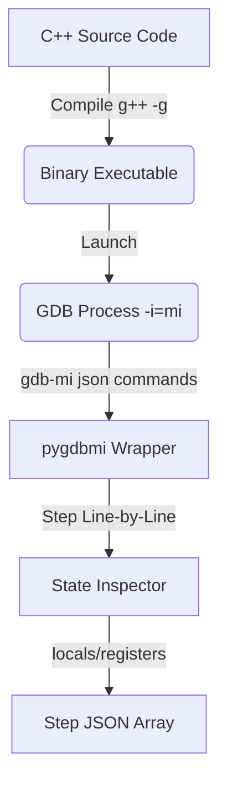

# AlgoLens C++ Support Integration Feasibility Study & Architectural Plan

This document evaluates the feasibility of adding C++ as a second supported programming language in the AlgoLens DSA visualization engine. It details the mechanisms for static AST analysis, step-by-step execution tracing, sandboxing, and resource estimation.

---

## 1. Static Parsing & AST Analysis (libclang / clang.cindex)

### libclang Availability and Setup
`libclang` provides stable, production-ready Python bindings (`clang.cindex`) to parse C++ source code into an Abstract Syntax Tree (AST). It is available across Windows, macOS, and Linux, requiring the installation of the LLVM compiler toolchain.

### Replicating current Python Classifier Logic
Clang parses C++ source code into cursor nodes (`CursorKind`). We can match the current Python classification rules by mapping AST nodes as follows:

1. **DP_TABLE Detection**:
   - **AST Node Match**: We traverse the AST searching for `CursorKind.FOR_STMT` or `CursorKind.WHILE_STMT`.
   - **Array Subscripting**: We identify subscripts via `CursorKind.ARRAY_SUBSCRIPT_EXPR`.
   - **Dependency Identification**: We check the LHS and RHS of binary operator assignments (`CursorKind.BINARY_OPERATOR`). If the RHS subscript expressions offset the loop induction variables (e.g. `i - 1`, `j - 2`), we flag it as a DP recurrence relation.
2. **Tree/List Node Structures**:
   - **AST Node Match**: We search for class/struct definitions (`CursorKind.CLASS_DECL` or `CursorKind.STRUCT_DECL`).
   - **Pointer Matching**: Inside classes/structs, we inspect pointer member variables (`CursorKind.FIELD_DECL`). If a struct `Node` contains fields of type `Node*` named `left`/`right`, we classify it as a Tree. If it contains a single pointer field `next`, we classify it as a Linked List.
3. **Entry-Point & Function Signature Detection**:
   - We scan for function declarations (`CursorKind.FUNCTION_DECL` or `CursorKind.CXX_METHOD`).
   - For a given candidate, we extract its parameter names and types (e.g. `std::vector<int>&`, `int`) using `get_arguments()` to compile drivers.

### Scope Constraints
To keep the AST parser lightweight, we restrict C++ support to:
- Standard types (`int`, `double`, `bool`, `char`, `std::string`).
- Standard template library (STL) containers used in DSA: `std::vector` and `std::array`.
- No template metaprogramming, multiple inheritance, or complex pointer arithmetic.

---

## 2. Programmatic Execution Tracing (GDB Machine Interface)

To emulate Python's `sys.settrace` debugger hook, C++ programs must be compiled with debug symbols (`-g`) and executed under a programmatic debugger controller.

### Tracing Mechanism (GDB MI)
We can utilize GDB’s Machine Interface (`gdb -i=mi`) wrapped in Python via `pygdbmi`.
- **Stepping**: We send `-exec-step` or `-exec-next` to step line-by-line.
- **State Capture**: On every break step, we query:
  - `-stack-list-locals --simple-values` to extract current local variables.
  - `-data-evaluate-expression` to retrieve the contents of dynamic structures (like `std::vector` sizes and heap node allocations).
- **Control Flow**: We parse GDB output frames (`~`, `^done`, `*stopped`) to record active line numbers and construct the step execution array.

### Performance & Latency Implications
- **Python**: `sys.settrace` runs completely in-memory inside the interpreter. It is extremely fast, logging ~10,000 frames/sec.
- **C++ (GDB)**: Running a binary under GDB MI requires process piping (stdin/stdout), operating system signals (`ptrace`), and string parsing for every single instruction step.
  - **Latency**: This introduces a latency overhead of ~15-50ms per frame.
  - **Smoothness Mitigation**: For long algorithms (e.g. 200+ steps), tracing might take up to 4 seconds. To preserve frontend responsiveness, we must caps the maximum execution steps to 300, and run the GDB trace asynchronously, returning the final trace steps array as a single cached payload.

---

## 3. Sandbox, Isolation & Security

Since C++ compiles to native machine instructions, executing untrusted user code poses a high exploit risk. We must implement a strict sandboxing environment.

### Isolation Strategy
- **Container Isolation**: Compile and run the binary inside a minimal Docker container sandboxed with **gVisor** (`runsc`). gVisor runs system calls in user-space, preventing host kernel compromise.
- **Resource Caps**:
  - **CPU Time**: Capped using `ulimit -t 2` (maximum 2 seconds execution time) to prevent CPU starvation from infinite loops.
  - **Memory Limit**: Docker `--memory="64m"` container memory cap to prevent RAM exhaustion.
  - **Network**: Docker `--network none` to isolate the container from the network.
  - **Filesystem**: Mount the root container as read-only (`--read-only`), mapping only a small in-memory tmpfs mount to `/tmp` for compilation outputs (cap size: 10MB).

### Compile & Runtime Error Recovery
- **Compile Errors**: Capture `g++` compilation output from `stderr`. We parse the lines containing error columns and return a clean validation error to the frontend.
- **Segfaults / Out-of-bounds**: When GDB encounters a segmentation fault or memory violation, it returns `*stopped,reason="signal-received",signal-name="SIGSEGV"`. We intercept this event, read the offending line number, and abort tracing. We package this safely as an `Error` step type (e.g. `"Segmentation fault: invalid memory read at Line X"`) and surface it cleanly in the frontend UI.
- **Infinite Loops**: The Docker run is executed with a process timeout wrapper (e.g., `timeout -k 1s 3s`). If it triggers a timeout, a clean `"Execution Timed Out"` step is pushed.

---

## 4. Development Effort & Complexity Estimate

### Directory/Module Extensions
To integrate C++ support, we would need to create the following new files in the backend, parallel to the Python modules:

| Module | Purpose | Python Equivalent | Complexity |
| :--- | :--- | :--- | :--- |
| `cpp_classifier.py` | AST structural classification using `libclang` | `dp_classifier.py` | Medium |
| `cpp_tracer.py` | GDB MI controller utilizing `pygdbmi` to step & read memory | `tracer.py` / `dp_tracer.py` | Very High |
| `cpp_adapter.py` | Synthesizes C++ driver wrappers (including JSON parser) | `leetcode_adapter.py` | High |
| `sandbox.py` | Controls Docker containers, gVisor execution, and timeouts | N/A | Medium |

### Complexity Comparison
- **Python (Current)**: **Low-Medium Complexity**. Introspection is natively supported (`sys.settrace` returns clean locals, AST module is built-in).
- **C++ (Proposed)**: **High Complexity**. Requires cross-process orchestration (GDB/Pipes), parsing raw pointers/memory addresses from GDB outputs to rebuild heap node layouts, and configuring container system call sandboxes.
- **Overall Estimate**: Implementing the C++ pipeline would require roughly **3-4 weeks** of dedicated backend development.
