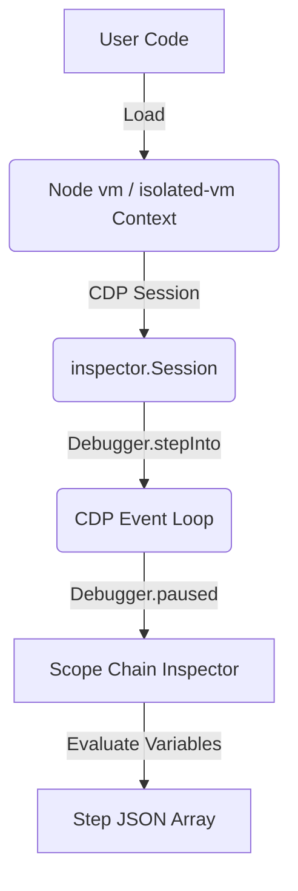

# AlgoLens JavaScript/Node.js Support Integration Feasibility Study & Architectural Plan

This document evaluates the feasibility of adding JavaScript (Node.js) as a second or third supported programming language in the AlgoLens DSA visualization engine. It outlines the options for AST analysis, execution tracing, secure sandboxing, and resource estimation.

---

## 1. Static Parsing & AST Analysis

### AST Parser Selection (Acorn vs Babel)
JavaScript has excellent AST parsing support. For this integration, we evaluate two options:
1. **Acorn** (Recommended): A tiny, fast, and standard JavaScript parser built on the ESTree specification. It is lightweight, has zero external dependencies, and is standard across the Node.js compiler ecosystem.
2. **Babel Parser** (`@babel/parser`): Generates more detailed AST nodes and has built-in support for modern ESNext features, JSX, and TypeScript type annotations (if we choose to support TypeScript visualization later).

### Translating Python Classifier Logic
The ESTree AST node mapping corresponds to our current Python classification rules as follows:

1. **DP_TABLE Detection**:
   - **AST Node Match**: We scan for loop nodes: `ForStatement`, `ForOfStatement`, or `WhileStatement`.
   - **Subscript Access**: Subscripts are identified via `MemberExpression` (where `computed` is `true`, representing `dp[i][j]` instead of `dp.i.j`).
   - **Recurrence Validation**: We inspect `AssignmentExpression`. If the RHS references the table variable (e.g. `dp[i - 1]`), we classify it as tabulation.
2. **Tree/List Node Structures**:
   - **Class Definitions**: We inspect property keys in `ClassDeclaration` or `ClassExpression`.
   - **Object Expressions**: In standard JS, tree/list nodes are often initialized as plain objects. We check `ObjectExpression` property keys. If an object is instantiated containing keys `{left, right}` or `{next}`, we classify it as a Tree or Linked List respectively.
3. **Entry-Point & Function Signatures**:
   - We scan for three function structures:
     - `FunctionDeclaration` (e.g., `function solve(x) {}`).
     - `FunctionExpression` (e.g., `const solve = function(x) {}`).
     - `ArrowFunctionExpression` (e.g., `const solve = (x) => {}`).
   - Parameter names are extracted from the `params` identifier list (e.g. `Identifier` nodes).

### JS-Specific AST Complications
- **Dynamic Typing**: Since JS parameters have no type annotations, the classifier cannot infer if a parameter is an array, object, or integer statically. We must rely on dynamic type checks during runtime tracing.
- **Lexical Closures**: Variables may reside in parent scopes (closures) rather than local function scopes, meaning the classifier must inspect nested scoping levels when validating array writes.
- **This Contexts**: Class methods may access members via `this.dp` rather than a local name, meaning we must check `this` member expressions (`ThisExpression`).

---

## 2. In-Process Execution Tracing (Node.js Inspector & CDP)

Unlike C++ which requires an external GDB debugger binary, Node.js provides a built-in `inspector` module that allows V8 execution states to be queried programmatically within the same process.



### Tracing Mechanism
We can establish a Chrome DevTools Protocol (CDP) session programmatically:
1. **CDP Session Initiation**: Call `const session = new inspector.Session(); session.connect();`.
2. **Step Control**: Post `Debugger.enable` and step through V8 execution frames line-by-line using `session.post('Debugger.stepInto')`.
3. **State Capture**: On every `Debugger.paused` event, we extract local variable structures by:
   - Reading the call frames array.
   - Accessing variables via scope chain objects (`callFrame.scopeChain`).
   - Querying object details using `Runtime.getProperties` or `Debugger.evaluateOnCallFrame` to inspect arrays/objects on the V8 heap in-process.

### Latency & Performance
- **V8 Native Speed**: Tracing via Node's internal CDP session runs in the same process boundary, meaning it has **zero process-piping or binary loading latency**.
- **Message Loop Latency**: Although in-process, CDP messages are passed asynchronously through event loops. It is slightly slower than Python's synchronous `sys.settrace` but significantly faster than GDB (~100–200 frames per second), ensuring smooth and efficient trace generation.

---

## 3. Sandboxing & Security

### In-Process VM vs. Container Isolation
- **Node.js `vm` Module**: Node's built-in `vm` module (`vm.runInNewContext`) is **not** a secure sandbox. The official documentation explicitly warns that it cannot be used to run untrusted code safely. A user-pasted script can easily escape the VM context using prototype property accessor chains:
  ```javascript
  this.constructor.constructor('return process')().exit()
  ```
- **Option A (isolated-vm)**: A native Node.js library that creates isolated V8 isolates. This is highly secure, lightweight, and supports strict memory caps and CPU execution limits in-process.
- **Option B (Container Sandboxing - Reused)**: Instead of introducing another sandboxing technology stack (like `isolated-vm` which requires native C++ compilation on the host machine), we can **reuse our C++ Docker/gVisor infrastructure**. We wrap the JS execution script in a minimal Node.js Docker container running in gVisor, disabling networking and restricting memory/CPU exactly as we do for C++.

### Recommended Strategy
Reusing the **Docker/gVisor container infrastructure** is the most robust and maintainable strategy. It ensures that security constraints are unified across all supported languages (Python, C++, JS) and requires no OS-specific native module compilation.

---

## 4. Development Effort & Complexity Estimate

### Directory/Module Extensions
To add JS support, we will create the following files in our backend:

| Module | Purpose | Equivalent | Complexity |
| :--- | :--- | :--- | :--- |
| `js_classifier.py` | Runs Python's `esprima` or a small Node script to classify AST | `dp_classifier.py` | Medium |
| `js_tracer.js` | Node script executing code under VM and generating CDP traces | `tracer.py` | High |
| `js_adapter.js` | Generates driver scripts for input cases and classes | `leetcode_adapter.py` | Medium |

### Complexity Comparison
- **Python**: **Low-Medium Complexity** (Synchronous, built-in debugger hook, safe type-checking).
- **JavaScript**: **Medium Complexity** (Asynchronous event loops, built-in inspector API, unified container sandboxing, no binary compile/linking step needed).
- **C++**: **Very High Complexity** (Process piping, compiler diagnostic parsing, GDB MI evaluation, native memory layout recovery).

### Overall Estimate
Since the Docker/gVisor sandboxing architecture is already mapped for C++ and the Node.js inspector module exposes structured JSON scoping details, implementing JS support is significantly easier than C++. It is estimated to require roughly **1.5 to 2 weeks** of development.
